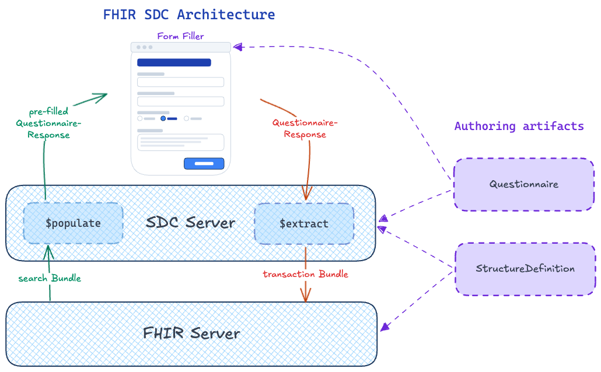
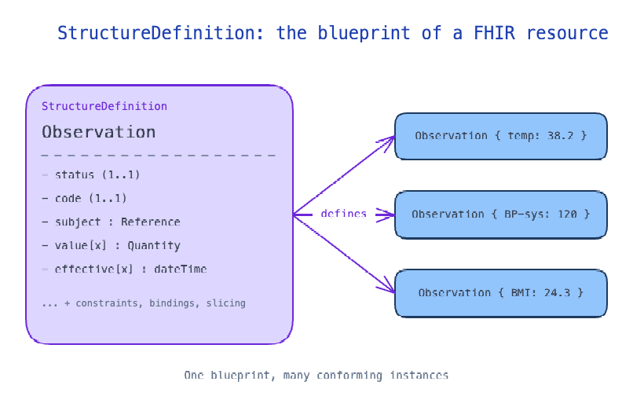

# FHIR SDC — A short overview

> A primer for FHIR-A-thon June 2026 participants. Assumes basic FHIR knowledge; focuses on
> the SDC-specific concepts behind this repository.

The FHIR [Structured Data Capture (SDC)](https://hl7.org/fhir/uv/sdc/) implementation guide
turns clinical forms into first-class FHIR artifacts. A form is a `Questionnaire`, a submitted
response is a `QuestionnaireResponse`, and the IG defines two server operations that move
data between those forms and the rest of the FHIR record:

- **[`$populate`](https://hl7.org/fhir/uv/sdc/OperationDefinition-Questionnaire-populate.html)**
  — pre-fill a form with data already in the FHIR server, so the clinician doesn't re-enter
  what is already known.
- **[`$extract`](https://hl7.org/fhir/uv/sdc/OperationDefinition-QuestionnaireResponse-extract.html)**
  — convert a completed response into discrete, profiled FHIR resources
  (`Observation`, `MedicationStatement`, `DiagnosticReport`, …) that other applications can
  search and reuse.

The result: forms stop being opaque text blobs and become a bidirectional bridge with the
rest of the patient record.

---

## Architecture



Two authoring artifacts drive both operations:

- **`Questionnaire`** — the form definition. Each item declares which field of which
  resource it represents via `Questionnaire.item.definition`.
- **`StructureDefinition`** — the profile (or logical model) that the populated/extracted
  resources conform to. Items in the questionnaire point into
  `StructureDefinition.snapshot.element[]`.

The **SDC server** is the component that knows how to interpret these links. The **FHIR
server** stores the resulting resources; it doesn't need to know anything SDC-specific.

---

## StructureDefinition — the blueprint of a FHIR resource

Every FHIR resource — every `Observation`, every `Patient`, every `MedicationStatement` — is
defined by a `StructureDefinition`. It is the blueprint: which elements exist, their data
types and cardinality, the value sets they bind to, and any constraints they must satisfy.
A resource instance is "valid" only insofar as it conforms to its `StructureDefinition`.



Profiles (e.g. `BeObservation`, `QERMID-Implant`) are themselves `StructureDefinition`s that
further constrain a base resource — narrowing cardinalities, requiring specific code systems,
fixing values. In an SDC pipeline, the same blueprint that validates a resource at write time
is also the contract that `$populate` and `$extract` follow when moving data through the
form.

> Source: [`sdc-resource-blueprint.excalidraw`](./sdc-resource-blueprint.excalidraw)

---

## Core resources

| Resource | Role | Authored by |
|---|---|---|
| `Questionnaire` | Form definition (items, types, skip logic, …). Each item links to a `StructureDefinition` element via `Questionnaire.item.definition`. | Domain expert |
| `QuestionnaireResponse` | The data captured for one filling of a `Questionnaire`. References its `Questionnaire` via `QuestionnaireResponse.questionnaire`. | Form filler (clinician, nurse, patient) |
| `StructureDefinition` | The profile or logical model the populated/extracted resources conform to. | Domain expert / registry |

---

## The bidirectional link

The mechanism this repository tests is called **definition-based**: each questionnaire item
carries a pointer to a single `StructureDefinition` ElementDefinition path, and the same
pointer can drive data flow in **both directions**.

```
Questionnaire.item.definition  →  <StructureDefinition canonical URL>#<ElementDefinition.id>
```

For example, an item that captures a body temperature might carry:

```json
{
  "linkId": "temp",
  "type": "decimal",
  "definition": "http://hl7.org/fhir/StructureDefinition/Observation#Observation.value[x]"
}
```

That single string powers two flows:

### `$extract` — write from the form into the FHIR record

The server walks the response items against the questionnaire's `.definition` pointers. For
each group marked with the extraction extension it builds a target resource skeleton and
writes the captured answers to the element paths. It returns a transaction `Bundle` of
profile-conforming resources ready to POST to the FHIR server.

Result: the same form definition that drives data entry also drives the structured output.
There is no separate per-form, per-vendor mapping code — the `Questionnaire` *is* the
mapping. See the [Form Data Extraction](https://hl7.org/fhir/uv/sdc/extraction.html#definition-based-extraction)
section of the SDC IG.

### `$populate` — read from the FHIR record into the form

For population, SDC supports several strategies. The expression-based approach
(`initialExpression` + `itemPopulationContext`, evaluated as FHIRPath) is the most widely
deployed. A more recent
[definition-based population](https://hl7.org/fhir/uv/sdc/populate.html#definition-based-population)
mechanism reuses the same `Questionnaire.item.definition` link in reverse: the server reads
existing values from the FHIR record at the target element path and writes them into a
pre-filled `QuestionnaireResponse`.

Result: the clinician opens the form and sees existing data already populated, instead of a
blank slate. They only edit what changed.

### Why the bidirectional link matters

One authored artifact, two automated flows, no custom integration glue. The `Questionnaire`
becomes both the form specification and the data-mapping specification, in either direction.
For a registry or clinical domain that publishes a `StructureDefinition`, this means the
extraction and population behaviour come for free once the questionnaire is annotated.

---

## Extraction targets

Definition-based extraction can target two kinds of structures:

- **Profiled FHIR resources** — e.g. a BeObservation or a QERMID implant report. This is
  [Test 1](../tutorials/test1-definition-based-extraction/README.md) in the tutorials and
  works on any compliant SDC server.
- **Logical models** — `StructureDefinition`s with `kind = logical`, used by registries that
  need a flat JSON shape rather than a graph of FHIR resources. This is
  [Test 2](../tutorials/test2-logical-model-extraction/README.md). Supported by the Tiro
  test server; HAPI does not yet support it
  (see [`hapi-extract-logical-model-root-cause.md`](hapi-extract-logical-model-root-cause.md)).

---

## Where to go next

**Specifications**

- [HL7 FHIR Structured Data Capture IG](https://hl7.org/fhir/uv/sdc/) — authoritative spec.
- [Form Data Extraction](https://hl7.org/fhir/uv/sdc/extraction.html) — all extraction
  strategies (definition-based, observation-based, StructureMap, template-based).
- [Form Population](https://hl7.org/fhir/uv/sdc/populate.html) — expression-based and
  definition-based pre-population.

**Tutorials in this repository**

- [Test 1 — Definition-based extraction to FHIR resources](../tutorials/test1-definition-based-extraction/README.md)
- [Test 2 — Extraction to a logical model](../tutorials/test2-logical-model-extraction/README.md)
- [Test 3 — Pre-population](../tutorials/test3-pre-population/README.md)

**Background docs**

- [Common errors & FAQ](./fse-faq.md)
- [Validation & lifecycle design](./sdc-extract-integrity-and-lifecycle.md)
- [Standalone Python extractor](./general-extractor.md)
